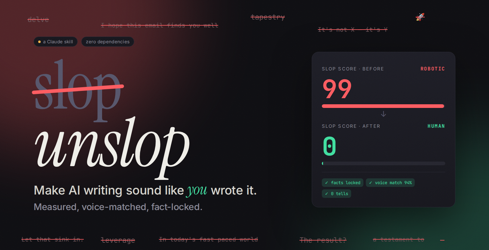
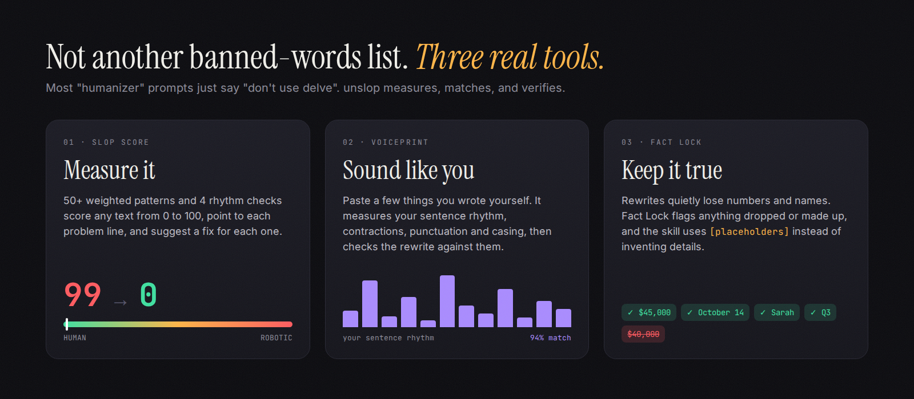
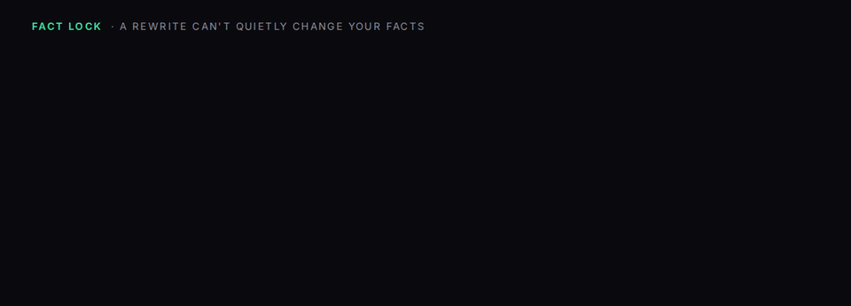
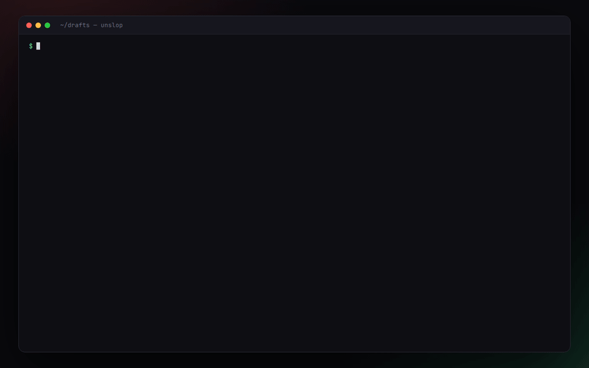
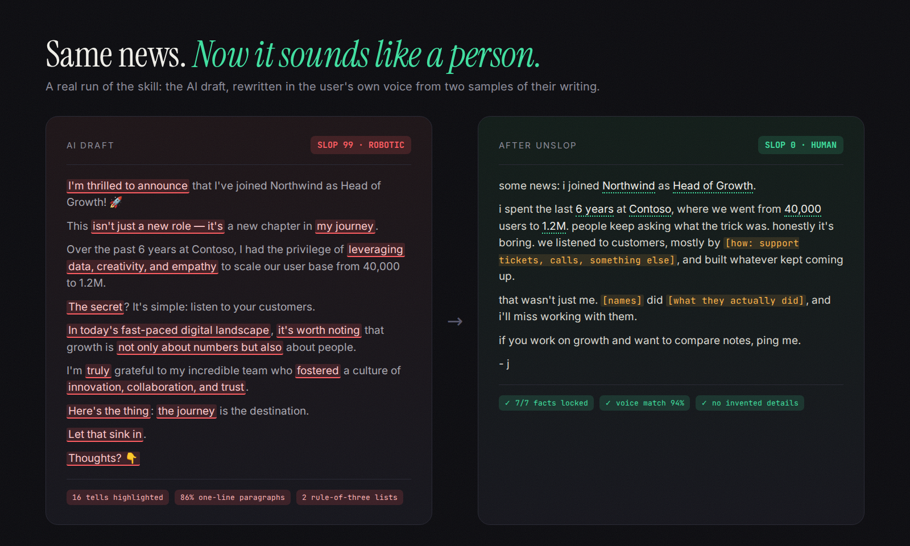

<p align="center">
  
</p>

<p align="center">
  <b>A Claude skill that takes the AI tells out of your writing and makes it sound like you, not like a different robot.</b><br>
  It measures every rewrite, matches how you really write, and refuses to quietly change your facts.
</p>

<p align="center">
  
  
  
  
  
</p>

<p align="center">
  <br>
  <sub>A real run: AI-written LinkedIn post → Slop Score 99 → rewritten in the user's own voice → 0. &nbsp;▶ <a href="media/demo.mp4">MP4 version</a></sub>
</p>

<p align="center">
  <a href="#-why-use-it">Why use it</a> ·
  <a href="#-see-it-in-action">See it in action</a> ·
  <a href="#-how-it-compares">How it compares</a> ·
  <a href="#-install">Install</a> ·
  <a href="#-how-to-use-it">How to use it</a> ·
  <a href="#-faq">FAQ</a>
</p>

---

## 🧭 The problem

People can spot AI writing in one sentence now. What gives it away is a stack of habits:

> ~~I'm thrilled to announce~~ … ~~This isn't just a new role — it's a new chapter in my journey.~~ … ~~The secret? It's simple:~~ … ~~Let that sink in.~~ … ~~Thoughts? 👇~~

Once someone notices, they stop reading generously. Your recruiter skims, your boss assumes you didn't think about it, and your followers scroll past.

Asking Claude to "make it sound more human" helps a bit, but you get a guess with no way to check it. Some tells always survive, the AI's voice replaces yours with a different one, and sometimes a number or a date quietly changes along the way.

## 💡 Why use it

<p align="center"></p>

| Benefit | What it means for you |
|---|---|
| **People read it as yours** | Gets rid of the 50+ habits that make readers think "ChatGPT wrote this": fake contrasts, drumroll questions, groups of three, em-dash pileups, "I hope this email finds you well", the LinkedIn one-line staircase. |
| **It sounds like *you*** | Paste two or three things you wrote yourself. unslop measures your style (sentence length, rhythm, contractions, punctuation, whether you write in lowercase, how you sign off) and matches the rewrite to it. |
| **Proof, not vibes** | Every rewrite gets a **Slop Score** from 0 to 100 before and after, and every problem line is shown with a suggested fix. You can see it worked. |
| **Your facts stay true** | **Fact Lock** checks that every number, name, date and link survived. Change $45,000 to $40,000 and it gets caught before you hit send. |
| **No made-up details** | Where only you know something (what the budget pays for, who on the team to thank), it leaves a `[placeholder]` instead of inventing a convincing lie. |
| **Right for the format** | An email, a Slack DM, a LinkedIn post and a cover letter each have different human norms. unslop knows them. |
| **Shorter and clearer** | Most slop is padding. Rewrites usually come out 30–50% shorter, with the point or the ask in the first two sentences. |
| **Free, private, offline** | The scanner is one Python file with no packages to install. It runs on your machine and never sends your text anywhere. |

### Who it's for

- **Job seekers:** cover letters and LinkedIn messages that don't get binned in five seconds.
- **Founders, creators and anyone posting on LinkedIn or X:** posts that sound like a person with a point of view.
- **Anyone writing work email and Slack** with AI help, who doesn't want their boss to notice.
- **Non-native English speakers** who use AI to polish their English but don't want to sound like a press release.
- **Students and writers** who draft with AI and then make it their own.
- **Developers and docs teams:** keep "seamless, robust, blazing-fast" out of your READMEs with a CI check.
- **Teams:** add your company's banned buzzwords and everyone's AI-assisted writing gets checked against them.

---

## 🎬 See it in action

### Claude alone vs Claude + unslop

Same model, same request, real outputs from our test run. Plain Claude did a decent job, but left a tell, buried the point and forgot to ask for anything:

<p align="center"></p>

### Voiceprint: it learns how *you* write

For this test, the user gave two short things they'd written (a team update and a rant about a code editor). That was enough. It noticed they write in lowercase, use short sentences, never use em-dashes or exclamation marks, and sign off with "- j", and the rewrite does the same. The scorecard is honest: the rewrite asks fewer questions than this person usually does, and it says so.

<p align="center"></p>

### Fact Lock: rewrites can't quietly change your facts

The biggest hidden risk with AI rewrites is that they "simplify" your numbers. Here a draft turned $45,000 into $40,000 and made the date vaguer, and Fact Lock caught both:

<p align="center"></p>

### The scanner: every tell, every line, with a fix

The real `unslop.py` output, no AI involved. Run it on anything you've written:

<p align="center"></p>

### Before → after

<p align="center"></p>

---

## ⚖️ How it compares

### Against plain Claude (measured)

Four realistic requests, each run **with the skill** and **without it** on the same model, then graded by a script on 18 checks. The prompts, outputs and grading script are all in [`evals/`](evals/).

| Request | Claude alone | Claude + **unslop** |
|---|---|---|
| "make this sound less like chatgpt, sending it to my boss" | **3/5**: still Slop 25, ends with "Let me know if you have any questions", no actual ask | **5/5**: Slop 0, ends with "Are you OK to approve it?", all facts locked |
| "rewrite my LinkedIn post so it sounds like me" (+2 samples) | **5/5**: good, but nothing measured | **5/5**: 94% voice match, 7/7 facts locked, two placeholders where it would otherwise have had to guess |
| "write me a cover letter… recruiters can tell when it's AI" | **4/5**: 360 words, and **made up an anecdote** ("I sat in on one of their meetings…") | **5/5**: 223 words, placeholders for anything it didn't know |
| "be honest, does this paragraph sound AI written?" | **2/3**: good critique, no measurement | **3/3**: verdict, six tells quoted, a score of 81/100 |
| **Pass rate** | **77%** | **100%** |
| Time / tokens per task | 29.5 s · 54k | 34.8 s · 61k |

About five extra seconds buys you a measured result, your own voice and no invented facts.

### Against other ways of "humanizing"

| | Editing by hand | Paraphraser / "humanizer" websites | A "sound human" prompt | **unslop** |
|---|---|---|---|---|
| Knows which phrases give AI away | if you've studied it | ✗ many just reword sentence by sentence | partly, from a word list | ✓ **50+ weighted patterns + 4 rhythm checks** |
| Fixes structure (fake contrast, drumrolls, rhythm) | ✓ slowly | ✗ | sometimes | ✓ |
| Sounds like *you* specifically | ✓ | ✗ | ✗ "casual tone" | ✓ **Voiceprint from your samples** |
| Shows that it worked | ✗ | an opaque "human %" | ✗ | ✓ **Slop Score + each line flagged** |
| Protects your numbers, names and dates | ✓ if careful | ✗ often mangles them | ✗ | ✓ **Fact Lock** |
| Refuses to invent details | ✓ | ✗ | ✗ often adds fake specifics | ✓ **placeholders** |
| Follows the norms of each format | ✓ | ✗ | ✗ | ✓ email, Slack, LinkedIn, cover letter, essay, tweet, docs, bio, academic |
| Your text stays private | ✓ | ✗ uploaded to a third party | depends | ✓ scanner runs locally |
| Usable in CI / scripts | ✗ | ✗ | ✗ | ✓ `--fail-above`, `--json` |
| Cost | your time | often a subscription | free | free, MIT |

---

## 📦 Install

Pick whichever matches how you use Claude.

**Claude.ai or the Claude desktop app**
1. Download [`dist/unslop.skill`](dist/unslop.skill).
2. Open **Settings → Capabilities → Skills**, click **Upload skill**, and choose the file.
3. Make sure code execution is turned on, since the scanner is a Python script.

**Claude Code**
```bash
git clone https://github.com/extradry1111/new.git
cp -r new/unslop ~/.claude/skills/unslop          # available in every project
# or, for one repo only:
cp -r new/unslop your-repo/.claude/skills/unslop
```

**Just the scanner, no Claude:** you only need [`unslop/scripts/`](unslop/scripts/) and Python 3.8+. See [the CLI section](#use-the-scanner-on-its-own).

---

## 🛠 How to use it

You don't need to remember any commands. Talk to Claude normally and the skill switches on when your request is about making writing sound human. Here are the main ways to use it.

### Quick start: 4 things to try

```text
make this email sound less like chatgpt, I'm sending it to my boss:
<paste>
```
```text
rewrite my linkedin post so it sounds like me. here are 3 things I actually wrote: <paste>
```
```text
write a cover letter for <job> at <company>. here's my background: ... recruiters can tell when it's AI, so don't
```
```text
be honest, does this sound AI written? <paste>
```

### Recipe 1: fix an AI draft in 30 seconds

1. Paste the draft and say what it is and who it's for ("email to my boss", "LinkedIn post", "Slack message to my team").
2. unslop scans it, rewrites it, scans again, and runs Fact Lock.
3. You get the clean text first, then a three-line report:

```
Slop Score 96 → 0 (ROBOTIC → HUMAN) · facts locked ✓ · voice match 88%
Cut: "hope this finds you well", fake contrast, 3 rule-of-three lists, "Ultimately,", "don't hesitate to reach out"
Needs you: [what the $45k pays for] in paragraph 2
```

4. Fill in any `[placeholders]` and send it.

> **Tip:** say who's reading it. "To my boss", "to a recruiter" or "to my team on Slack" change the tone, length and sign-off.

### Recipe 2: clone your voice once, use it forever

This is what makes the output sound like **you** rather than generic "human".

1. Collect **150+ words you wrote yourself without AI**, ideally 500+. Old emails, Slack messages, posts and notes all work. Two or three samples of different kinds are better than one long one.
2. Say: *"here are some things I wrote myself, learn my style"* and paste them.
3. unslop builds your voiceprint and tells you what it found, for example: *"short and punchy sentences, starts 96% of sentences lowercase, contracts a lot, never uses exclamation marks, signs off with '- j'"*.
4. From then on, rewrites are checked against it, and you'll see a **voice match %** in every report.

> **Keeping it between sessions:** in Claude Code the voiceprint is saved as `voice.json` in your project, so it's reused automatically. In Claude.ai, put your samples in a **Project** (or paste them again) so every chat has them.

### Recipe 3: write something from scratch that doesn't sound AI

Ask for the email, post or cover letter as usual and mention it shouldn't sound AI-generated. unslop writes the draft, **scans its own draft**, fixes what it finds, and only then shows you the result. Expect placeholders wherever it needs a fact only you know. That's deliberate, because made-up details are how AI cover letters get caught.

### Recipe 4: roast mode, "does this sound AI?"

Paste anything and ask. You get a verdict, the Slop Score, and the worst lines quoted with the reason each one gives the text away. It doesn't rewrite unless you ask, so this is also a good way to learn the tells and stop writing them yourself.

### Recipe 5: pick the right format

unslop guesses the format from your request, but saying it helps. Here's what it does differently for each:

| Format | What changes |
|---|---|
| **Work email** | Point or ask in the first two lines, one ask with a deadline, 50–150 words, a subject line that says what you need |
| **Slack / DM** | No greeting or sign-off, one to three lines, the question goes last |
| **LinkedIn** | A real hook (a fact or a take), normal paragraphs instead of a staircase, at most one emoji, no "Thoughts? 👇" |
| **Cover letter** | Opens with why *this* company, 2–3 concrete proof points, 200–300 words, no "passionate" |
| **Essay / blog** | Your take in paragraph one, examples over abstractions, no recap at the end |
| **Tweet / X** | One idea, lowercase is fine if that's you, no hashtag walls |
| **Docs / README** | Keeps structure (headers and bullets are fine here) and cuts the marketing adjectives |
| **Academic / formal** | Clear rather than casual, keeps real hedges, target score ≤ 25 instead of ≤ 15 |

### What a "good" result looks like

| Slop Score | Meaning | What to do |
|---|---|---|
| **0–15** | HUMAN | Send it |
| **16–35** | LIGHT TOUCH | Fine for formal docs. For email and posts, fix the flagged lines. |
| **36–60** | NOTICEABLY AI | Most readers will notice. Rewrite. |
| **61–100** | ROBOTIC | Everyone will notice. |

The score is a tool, not the goal. The final test is whether a sharp friend would believe a person wrote it.

---

## Use the scanner on its own

`unslop/scripts/unslop.py` is a standalone CLI with no dependencies. It's handy if you write yourself and just want a second opinion.

```bash
# Slop Score + every flagged line with a fix
python3 unslop/scripts/unslop.py scan draft.txt

# Before/after report + Fact Lock in one go
python3 unslop/scripts/unslop.py compare before.txt after.txt

# Build your voiceprint, then check a draft against it
python3 unslop/scripts/unslop.py voice my_emails/*.txt my_posts/*.txt -o me.json
python3 unslop/scripts/unslop.py voicecheck draft.txt --profile me.json

# Did the facts survive? (exit code 2 if not)
python3 unslop/scripts/unslop.py lock original.txt rewrite.txt

# Read from stdin, or get JSON for your own tooling
pbpaste | python3 unslop/scripts/unslop.py scan -
python3 unslop/scripts/unslop.py scan draft.txt --json
```

### Block slop in CI

`--fail-above N` exits with code 1 when the score is over N. Here's a GitHub Actions check for your docs:

```yaml
# .github/workflows/unslop.yml
name: unslop
on: [pull_request]
jobs:
  slop-check:
    runs-on: ubuntu-latest
    steps:
      - uses: actions/checkout@v4
      - name: Scan docs for AI slop
        run: |
          for f in docs/*.md; do
            python3 unslop/scripts/unslop.py scan "$f" --fail-above 30
          done
```

### Add your own banned phrases

Create a JSON file in the same shape as [`slop_patterns.json`](unslop/scripts/slop_patterns.json) and pass it with `--extra`:

```json
[
  {"id": "acme-synergize", "category": "house-style", "regex": "\\bsynergi[sz]e\\b",
   "weight": 3, "label": "\"synergize\"", "fix": "work together"},
  {"id": "acme-circle-back", "category": "house-style", "regex": "\\bcircle back\\b",
   "weight": 2, "label": "\"circle back\"", "fix": "follow up, or give a date"}
]
```
```bash
python3 unslop/scripts/unslop.py scan memo.txt --extra acme_patterns.json
```

---

## 🔬 How the Slop Score works

1. **Patterns.** Each of the 50+ patterns has a weight for how strongly it signals AI. "It's not X, it's Y" weighs 3, while a lone "crucial" weighs 1.2. Hits are counted **per 100 words**, so one "crucial" in a long essay barely registers but three in a tweet do.
2. **Rhythm.** Four checks no word list can do:
   - variation in sentence length (people mix 4-word and 30-word sentences; models don't)
   - em-dash density
   - how many "A, B, and C" lists there are
   - the one-line-paragraph staircase
3. **The curve.** The total goes through a curve that levels off near 100: one slip in a long piece barely moves it, and a tell in every sentence pushes it close to 100.

The skill also tells Claude what *not* to do. Swapping in synonyms the scanner doesn't know yet doesn't count as a fix. Neither do fake typos, forced slang, or swapping every em-dash for a semicolon (that's just a new tell).

## ❓ FAQ

<details><summary><b>Will it beat AI detectors?</b></summary>

It isn't built or tested for that, and we don't claim it does. unslop is for human readers: your boss, a recruiter, your audience. If something has to be your own unaided work (graded coursework, for example), using AI and hiding it isn't something this tool will help with.
</details>

<details><summary><b>Does my text get sent anywhere?</b></summary>

The scanner, Voiceprint and Fact Lock run locally as a plain Python script with no network calls. Claude itself sees your text the same way it sees anything you paste into a chat.
</details>

<details><summary><b>Will it change what I meant?</b></summary>

Meaning is locked: every fact, number, name, date, commitment and ask has to survive, and Fact Lock checks it. If the original was vague, unslop doesn't fill the gap with invented details. It leaves a `[placeholder]` for you.
</details>

<details><summary><b>Why are there [placeholders] in my text?</b></summary>

AI drafts are vague because the AI didn't know the details. "Drive meaningful results" is what you get when nobody said *what* results. Only you know those, so unslop marks them instead of making something up. Fill them in, or delete the sentence if it wasn't needed.
</details>

<details><summary><b>Does it work in other languages?</b></summary>

The pattern library is written for English. Voiceprint and Fact Lock mostly work for other Latin-script languages, but the Slop Score will under-count tells in them. Pull requests adding patterns for other languages are very welcome.
</details>

<details><summary><b>Will it flag my own writing?</b></summary>

Sometimes, and that's useful. People pick up these habits from reading AI text too. One "crucial" or a single em-dash won't move the score much, because it measures density, not single words. Real technical terms ("robust" in a stats paper) are fine, and the skill knows that.
</details>

<details><summary><b>Can I use the scanner without Claude?</b></summary>

Yes. `unslop.py` is a standalone CLI. See [Use the scanner on its own](#use-the-scanner-on-its-own).
</details>

---

## 📁 What's inside

```
unslop/                          ← the skill (this folder is what you install)
├── SKILL.md                     # the workflow Claude follows
├── scripts/
│   ├── unslop.py                # scanner · voiceprint · fact lock · compare (stdlib only)
│   └── slop_patterns.json       # pattern library: regex, weight, label, suggested fix
├── references/
│   ├── slop-patterns.md         # readable catalog + the tells only a human eye catches
│   ├── rewrite-playbook.md      # how to rewrite well, with worked examples
│   └── modes.md                 # norms per format: email, Slack, LinkedIn, cover letter…
└── examples/                    # sample drafts, rewrites and voice samples to try it on
dist/unslop.skill                ← one-click install file for Claude.ai
evals/                           ← test prompts, grading script, benchmark, review page
media/                           ← the images and videos in this README
```

## 🤝 Contributing

Found a tell unslop misses? Open an issue or a PR with:
1. an example sentence (real AI output is best),
2. a pattern for [`slop_patterns.json`](unslop/scripts/slop_patterns.json),
3. a one-line fix suggestion.

Then run `python3 unslop/scripts/unslop.py scan unslop/examples/human_email.txt` to make sure human writing still scores low.

---

<p align="center"><sub>Built as a <a href="https://docs.claude.com/en/docs/agents-and-tools/agent-skills/overview">Claude Agent Skill</a> · MIT licensed</sub></p>
