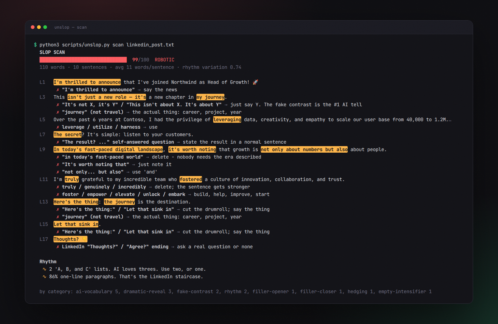

<p align="center">
  
</p>

<p align="center">
  <b>A Claude skill that removes the AI tells from your writing and makes it sound like you, not like a different robot.</b><br>
  It measures every rewrite, matches your real writing style, and refuses to quietly change your facts.
</p>

<p align="center">
  
  
  
  
</p>

---

<p align="center">
  <br>
  <sub>▶ <a href="media/demo.mp4">Watch the full-quality video (MP4)</a></sub>
</p>

## The problem

Everyone can spot AI writing now. The giveaway usually isn't one word. It's a stack of habits:

> ~~I'm thrilled to announce~~ … ~~This isn't just a new role — it's a new chapter in my journey.~~ … ~~The secret? It's simple:~~ … ~~Let that sink in.~~ … ~~Thoughts? 👇~~

Most "humanizer" prompts are a list of banned words. The model swaps "delve" for "dig into", keeps every other habit, and quietly changes your numbers while it's at it.

**unslop is different. It ships with real tools, not just instructions.**

<p align="center"></p>

| | Typical humanizer prompt | **unslop** |
|---|---|---|
| Finds AI tells | a list of words to avoid | **50+ weighted patterns + 4 rhythm checks** (fake contrast, drumroll questions, rule of three, em-dash pileups, flat sentence rhythm, LinkedIn staircase…) |
| Proves it worked | "trust me" | **Slop Score 0–100**, before and after, with each problem line flagged |
| Sounds like *you* | "use a casual tone" | **Voiceprint**: measures your real writing (rhythm, contractions, punctuation, casing) and scores the rewrite against it |
| Keeps your facts | 🤞 | **Fact Lock**: catches any number, name, date or link that got dropped or made up |
| Makes things up | often, to "add specificity" | never: uses `[placeholders]` for details only you know |
| Knows the format | one style for everything | separate rules for email, Slack, LinkedIn, cover letter, essay, tweet, docs, bio, academic |

## Before → after (a real run)

<p align="center"></p>

This is real skill output, not a mockup. The user gave Claude their AI-written LinkedIn post plus two short things they'd written themselves (a team update and a rant about a code editor). unslop picked up that they write in lowercase, use short sentences, say "honestly", and sign off with "- j", and wrote the post that way.

## What the scanner sees

<p align="center"></p>

## Benchmarks

Four realistic prompts, each run **with the skill** and **without it** (same model), and graded by a script on 18 checks:

| Test | Without skill | With **unslop** |
|---|---|---|
| "make this sound less like chatgpt, sending it to my boss" | 3/5: still Slop 25, no clear ask | **5/5**: Slop 0, facts locked, ends with a real ask |
| LinkedIn post in my voice (from 2 samples) | 5/5 | **5/5**: 94% voice match, 7/7 facts |
| Cover letter from scratch, "don't make it sound AI" | 4/5: 360 words, **made up an anecdote** | **5/5**: 223 words, placeholders instead of made-up details |
| "does this paragraph sound AI written?" | 2/3 | **3/3**: verdict, the tells quoted, a score |
| **Total** | **77%** | **100%** |

The cost is about 5 seconds and roughly 6k tokens per task. The full eval set and an interactive review page are in [`evals/`](evals/).

## Install

**Claude.ai / Claude desktop app:** download [`dist/unslop.skill`](dist/unslop.skill), then go to **Settings → Capabilities → Skills → Upload skill**.

**Claude Code:**
```bash
git clone https://github.com/extradry1111/new.git
cp -r new/unslop ~/.claude/skills/unslop        # for all your projects
# or: cp -r new/unslop .claude/skills/unslop    # for just one repo
```

That's it. Then just talk to Claude normally:

```
make this email sound less like chatgpt, sending it to my boss
```
```
rewrite my linkedin post so it sounds like me. here's 3 things I actually wrote: ...
```
```
be honest, does this sound AI written?
```
```
write a cover letter for <job>. recruiters can tell when it's AI, so don't
```

## Use the scanner yourself (no AI needed)

`unslop.py` is a standalone, zero-dependency CLI:

```bash
python3 unslop/scripts/unslop.py scan draft.txt                  # Slop Score + every flagged line
python3 unslop/scripts/unslop.py compare before.txt after.txt     # before/after + Fact Lock
python3 unslop/scripts/unslop.py voice my_posts/*.txt -o me.json  # build your voiceprint
python3 unslop/scripts/unslop.py voicecheck draft.txt --profile me.json
python3 unslop/scripts/unslop.py lock original.txt rewrite.txt    # exits 2 if facts changed
cat post.txt | python3 unslop/scripts/unslop.py scan -            # stdin works too
```

**Keep slop out of your docs in CI:** `scan --fail-above 30` exits with code 1, so a README full of "seamless, robust, cutting-edge" can fail a PR check.

**Add your own pet peeves:** write a JSON file in the same shape as [`slop_patterns.json`](unslop/scripts/slop_patterns.json) (for example your company's buzzwords) and pass `--extra my_patterns.json`.

## How the Slop Score works

1. **Patterns.** Each of the 50+ patterns has a weight for how strongly it signals AI. "It's not X, it's Y" weighs 3, a lone "crucial" weighs 1.2. Hits are added up **per 100 words**, so one "crucial" in a long essay barely registers while three in a tweet do.
2. **Rhythm.** Four checks that no word list can do:
   - variation in sentence length (people mix 4-word and 30-word sentences; models don't)
   - em-dash density
   - how many "A, B, and C" lists there are
   - the one-line-paragraph staircase
3. **The curve.** The total goes through a curve that levels off near 100, so the score lands from 0 to 100: **0–15 HUMAN · 16–35 LIGHT TOUCH · 36–60 NOTICEABLY AI · 61+ ROBOTIC**.

The skill tells Claude to treat the score as a tool, not a target. Swapping in synonyms the scanner doesn't know yet doesn't count. The final test is a read-aloud check: would a sharp friend think a person wrote this?

## What's inside

```
unslop/
├── SKILL.md                    # the workflow Claude follows
├── scripts/
│   ├── unslop.py               # scanner · voiceprint · fact lock · compare (stdlib only)
│   └── slop_patterns.json      # pattern library: regex, weight, label, suggested fix
├── references/
│   ├── slop-patterns.md        # readable catalog + the tells only a human eye catches
│   ├── rewrite-playbook.md     # how to rewrite well, with worked examples
│   └── modes.md                # norms per format: email, Slack, LinkedIn, cover letter…
└── examples/                   # sample drafts, rewrites and voice samples to try it on
```

## A note on honesty

unslop makes your writing better for **people**: your boss, a recruiter, your followers. It isn't built or tested to beat AI-detection software, and it won't help you pass off generated work where AI isn't allowed. Use it on your own drafts, and let them sound like you.

---

<p align="center"><sub>Built as a <a href="https://docs.claude.com/en/docs/agents-and-tools/agent-skills/overview">Claude Agent Skill</a>. MIT licensed. PRs adding new tells are very welcome.</sub></p>
